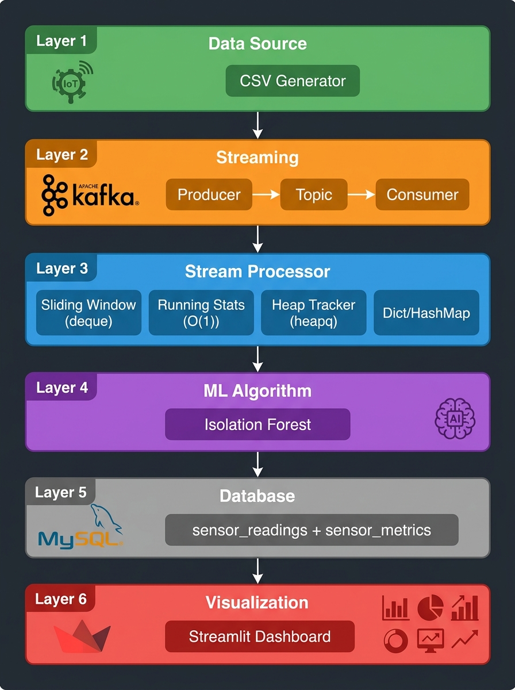

# Real-Time IoT Sensor Streaming Analytics and Anomaly Detection System

## Data Stream Analytics — DSA Mini Project

### Group 3

| USN | Name |
|---|---|
| 23BTRCL227 | P CHETHAN |
| 23BTRCL217 | MUKKAMALLA LOKESHWAR REDDY |
| 23BTRCL221 | NADAKUDURU SRINIVAS |
| 23BTRCL233 | SOMISETTY JAGANNADA KAILASH |

### Submitted To

**Dr. Archana Sasi**

---

## 1. Project Overview

The project is a real-time IoT sensor streaming analytics system that continuously processes sensor events, calculates streaming metrics, detects abnormal sensor behavior using Isolation Forest, stores results in MySQL, and displays them through a Streamlit dashboard.

The system processes incoming data event-by-event, updating sliding window aggregations and anomaly trackers with minimal latency.

---

## 2. Problem Statement

Industrial IoT systems continuously generate sensor readings from machinery. If the readings are processed only later in batches, abnormal machine behavior may be detected too late, leading to costly equipment damage or unplanned downtime.

Our system processes the incoming readings continuously and identifies unusual sensor behavior in near real time, enabling immediate corrective action.

---

## 3. Objectives

1. Ingest continuous IoT telemetry streams with guaranteed partition ordering using Apache Kafka.
2. Implement efficient streaming Data Structures and Algorithms (DSA) including sliding windows, running statistics, and priority queues.
3. Detect multi-feature sensor anomalies using an unsupervised Isolation Forest model in real time.
4. Persist processed readings and running aggregations in a relational MySQL database.
5. Provide a responsive, live-updating Streamlit dashboard for real-time monitoring and anomaly exploration.
6. Verify pipeline correctness and time/space complexities with a comprehensive automated test suite.

---

## 4. Architecture

The pipeline follows an end-to-end six-layer streaming architecture:

```
Data Source (Synthetic IoT Generator)
       ↓
Apache Kafka (Topic: iot-sensor-events)
       ↓
Stream Processor (Python Consumer)
       ↓
DSA Processing + Isolation Forest Anomaly Scoring
       ↓
MySQL Database (sensor_readings & sensor_metrics)
       ↓
Streamlit Live Dashboard
```



---

## 5. Technology Stack

| Component | Technology | Description |
|---|---|---|
| Data Source | Synthetic IoT Sensor Data | Multi-sensor reading simulator with controlled anomaly injection |
| Streaming | Apache Kafka | Distributed event streaming broker (Topic: `iot-sensor-events`) |
| Processing | Python | Event consumer with real-time validation and aggregation |
| DSA | Deque, Hash Map, Min-Heap | Core memory structures for bounded sliding windows and statistics |
| ML | Isolation Forest | Unsupervised ensemble model for multivariate outlier detection |
| Database | MySQL | Relational persistence for readings and aggregated metrics |
| Dashboard | Streamlit + Plotly | Interactive, auto-refreshing operational dashboard |
| Testing | pytest | 31 unit and integration test assertions |
| Infrastructure | Docker Compose | Containerized ZooKeeper, Kafka broker, and MySQL services |

---

## 6. DSA Concepts Used

| Concept / Data Structure | Implementation | Purpose | Time Complexity | Space Complexity |
|---|---|---|---|---|
| **Deque (Sliding Window)** | `collections.deque(maxlen=30)` | Maintains the last 30 readings per metric per device for rolling metrics | Append: **O(1)**<br/>Eviction: **O(1)**<br/>Rolling avg: **O(w)** | **O(w)** bounded |
| **Hash Map** | Python `dict` | Maps device IDs to their respective sliding windows and state objects | Lookup / Update: **O(1)** average | **O(d)** where d = devices |
| **Running Statistics** | Incremental Accumulators | Tracks running count, sum, average, min, and max without re-scanning historical data | Update: **O(1)** | **O(1)** |
| **Min-Heap (Priority Queue)** | `heapq` | Maintains bounded top-N (k=20) most critical anomalies sorted by severity score | Push / Replace: **O(log k)**<br/>Peek threshold: **O(1)** | **O(k)** bounded |

*Note on Kafka ordering: Messages within a Kafka partition maintain their strict order of arrival.*

---

## 7. Machine Learning

The system utilizes an **Isolation Forest** model to detect multivariate operational anomalies:

- **Features Used**: Temperature, Humidity, Pressure, Vibration (4 continuous sensor features).
- **Preprocessing**: `StandardScaler` fitted on baseline readings to normalize feature scales.
- **Model Parameters**: 200 isolation trees (`n_estimators=200`), contamination rate set to `0.05` (5%).
- **Offline Training**: Trained on historical baseline data and serialized to `models/anomaly_model.pkl`.
- **Live Scoring**: Loaded once into memory at processor startup. Each incoming event is transformed and scored via `decision_function()` and classified via `predict()`.
- **Mechanism**: Rather than computing distance metrics, Isolation Forest isolates outliers by recursively partitioning feature space, identifying anomalies as points requiring fewer splits.

---

## 8. Dataset

The project includes a synthetic dataset representing industrial telemetry:

- **Devices**: 5 distinct industrial sensor units (`sensor-01` to `sensor-05`).
- **Record Count**: 5,000 continuous time-series records.
- **Telemetry Channels**:
  - Temperature (°C)
  - Humidity (%)
  - Pressure (hPa)
  - Vibration (mm/s)
- **Anomaly Injection**: Approximately 5% intentionally injected anomalies (spikes, drops, drift, and correlated multi-sensor anomalies).
- **Nature of Data**: Synthetic dataset generated via `data/generate_data.py` for reproducible testing and evaluation.

---

## 9. Database

Processed events and aggregated telemetry are stored in MySQL (`iot_streaming` database) across two tables:

1. **`sensor_readings`**:
   - Stores each incoming event after processing.
   - Columns: `id`, `timestamp`, `device_id`, `temperature`, `humidity`, `pressure`, `vibration`, `rolling_temperature`, `rolling_humidity`, `rolling_pressure`, `rolling_vibration`, `anomaly_score`, `is_anomaly`, `processed_at`.
   - Indexed on `device_id`, `timestamp`, and `is_anomaly` for fast filtering.

2. **`sensor_metrics`**:
   - Stores real-time cumulative and statistical summaries per device.
   - Columns: `device_id`, `total_readings`, `anomaly_count`, `latest_*`, `avg_*`, `min_*`, `max_*`, `latest_anomaly_score`, `updated_at`.
   - Updated atomically using `ON DUPLICATE KEY UPDATE`.

---

## 10. Dashboard

The live Streamlit dashboard (`dashboard/app.py`) provides real-time operational visibility:

- **Executive KPI Cards**: Total processed events, detected anomalies, overall anomaly rate (%), and active reporting devices.
- **Live Sensor Telemetry**: Interactive time-series charts for temperature, humidity, pressure, and vibration with 30-point rolling average trendlines.
- **Visual Anomaly Markers**: Anomalous events highlighted directly on charts for fast visual inspection.
- **Top Anomalies Table**: Most severe anomalous readings prioritized by anomaly score.
- **Device Health Summary**: Comparative tabular breakdown of min, max, and average metrics across all active devices.
- **Interactive Controls**: Device selection filter (`All` or specific device) and configurable auto-refresh interval.

---

## 11. Project Structure

```
DSA-mini-project/
├── README.md                          # Project documentation
├── requirements.txt                   # Python package dependencies
├── docker-compose.yml                 # ZooKeeper, Kafka, and MySQL services
├── .env.example                       # Environment configuration template
├── .gitignore                         # Git exclusion rules
│
├── data/
│   ├── generate_data.py               # Synthetic IoT data generator
│   └── sensor_data.csv                # Baseline dataset (5,000 rows)
│
├── kafka/
│   ├── producer.py                    # Kafka telemetry producer
│   └── consumer_config.py             # Kafka consumer configuration
│
├── processor/
│   ├── stream_processor.py            # Stream processing engine
│   ├── window_manager.py              # Deque-based sliding window manager
│   ├── statistics.py                  # O(1) running statistics tracker
│   └── anomaly_tracker.py             # Min-Heap top-N anomaly tracker
│
├── ml/
│   ├── train_model.py                 # Offline Isolation Forest training script
│   └── model_utils.py                 # Real-time scoring and loading utilities
│
├── models/
│   └── anomaly_model.pkl              # Trained Isolation Forest model artifact
│
├── database/
│   ├── schema.sql                     # MySQL table creation scripts
│   └── db.py                          # Connection pooling and query helpers
│
├── dashboard/
│   └── app.py                         # Streamlit interactive dashboard
│
├── tests/
│   ├── test_window.py                 # Sliding window unit tests
│   ├── test_statistics.py             # Running statistics unit tests
│   ├── test_anomaly_tracker.py        # Min-Heap tracker unit tests
│   ├── test_data.py                   # Data generator unit tests
│   └── test_integration_dsa.py        # End-to-end DSA pipeline integration tests
│
├── scripts/
│   ├── setup.py                       # Automated environment initialization
│   ├── start_pipeline.py              # Multi-component pipeline runner
│   └── reset_database.py              # Database reset utility
│
└── docs/
    ├── DSA_Mini_Project_Report.pdf    # Complete academic project report (15 pages)
    ├── DSA_Mini_Project_Presentation.pptx # Project presentation slides (12 slides)
    ├── demo_script.md                 # Step-by-step viva demonstration script
    ├── architecture.png               # System architecture diagram
    └── architecture.mmd               # Mermaid source architecture diagram
```

---

## 12. How to Run

### Step 1: Start Infrastructure (Kafka & MySQL)

```bash
docker compose up -d
```

*Wait approximately 20–30 seconds for ZooKeeper, Kafka, and MySQL to initialize.*

### Step 2: Install Dependencies

```bash
pip install -r requirements.txt
```

### Step 3: Setup Project (Data, Database & Model)

```bash
python scripts/setup.py
```

### Step 4: Start the Stream Processor

```bash
python processor/stream_processor.py
```

### Step 5: Launch the Dashboard

In a second terminal:

```bash
streamlit run dashboard/app.py
```

*The dashboard will be available in your browser at `http://localhost:8501`.*

### Step 6: Start Streaming Data (Producer)

In a third terminal:

```bash
python kafka/producer.py --delay 0.5
```

---

## 13. Testing

The project includes an automated test suite covering DSA sliding windows, statistics calculation, priority queues, data generation, and pipeline integration.

Run the test suite with:

```bash
pytest
```

**Verified Test Result**:
```text
31 / 31 tests passed (100% pass rate)
```

---

## 14. Documentation

Comprehensive documentation is available in the `docs/` folder:

- **Academic Project Report (PDF)**: [docs/DSA_Mini_Project_Report.pdf](docs/DSA_Mini_Project_Report.pdf) *(15 pages)*
- **Presentation Slides (PowerPoint)**: [docs/DSA_Mini_Project_Presentation.pptx](docs/DSA_Mini_Project_Presentation.pptx) *(12 slides)*
- **Viva Demonstration Script**: [docs/demo_script.md](docs/demo_script.md)
- **Architecture Diagram**: [docs/architecture.png](docs/architecture.png)
